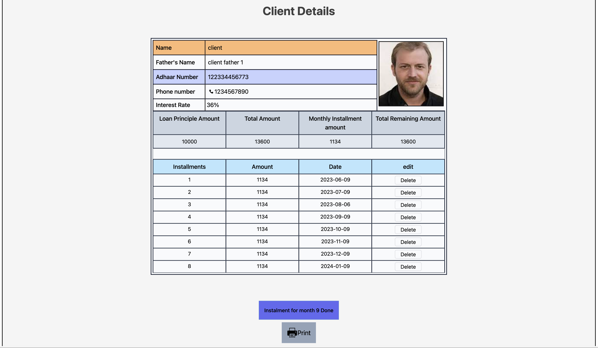
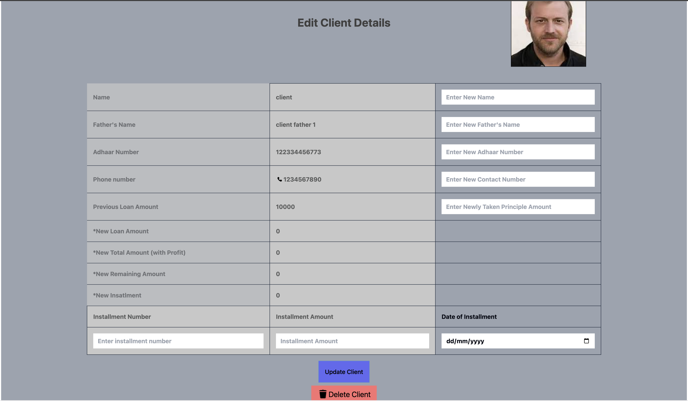

# E MONEY-LENDER
A mern stack project

## Description
Welcome to this project! This is a project to be used by Money Lenders to keep records, update and manage information of their clients.

## Tools, Libraries and Frameworks used in 

<b>Frontend</b> :
1. Vite
2. @tanstack/react-query
3. Chart-JS
4. axios
5. react-cookie
6. react-router-dom
8. react-hot-toast
9. Tailwindcss as Postcss

<b>Backend</b> :
1. bcryptjs
2. cors
3. express
4. jsonwebtoken
5. mongoose
6. multer
7. nodemon

## Project Plan :

## Preview Pages :

  
  login Page 

  
  

  
  

  
  

  
  

  
  

  
  

[Have a look!](http://e-money-lender.vercel.app/)
